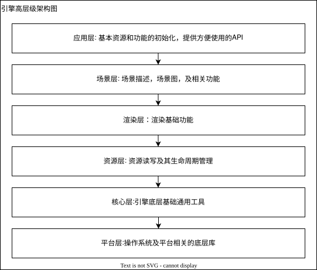

= 引擎架构

== 设计目标

一个进阶版现代图形渲染引擎，本项目需要易于开发，维护，扩展，调试，测试，部署，理解，使用

== 关键指导思想

. SOLID: 高内聚、低耦合，多扩展少修改, 用抽象建立契约, 接口和实现分离，慎重引入依赖，依赖要倒置
. YAGNI: 不高估未来的需求，避免过度设计，过度工程化，过早优化
. KISS: 设计和实现简单，易于理解
. EA: 演进式架构，基于版本稳步演进

务实执行上述思想，不教条，工具和开发规约保障基本底线，平衡开发效率和质量

== 开发目标

. 功能实现符合预期，核心渲染循环具备可预测性
. 代码质量良好: 由工具和规约保障底线
. 代码易于测试: 为了平衡单人开发效率，有关键功能的简单测试，并保证通过, 目前为手写，后期可用AI生成更多测试用例
. 代码易于理解：由注释和文档保障，完成功能的同时，同时尽量减少代码量和高层次抽象，现阶段以体现设计思路，完成功能为主
. 代码易于调试: 主要由日志，调试工具，和可视化窗口保障

对于扩展性和健壮性，会在设计时基于具体场景进行权衡，一般来说会保留扩展空间，但不做过于超前的设计

目前整个引擎的设计为自主设计，代码和文档为手写，暂不引入AI

=== 运行时目标

. 引擎: 各个核心组件正常，生命周期可追踪、无内存泄漏，测试用例通过
. 线程功能: 保证线程安全, 执行正确，生命周期可追踪
. 渲染功能: 渲染Pass的执行顺序、资源屏障, 同步机制正确。无显存越界、无验证层报错、无画面闪烁等其他明显的显示问题
. 资源加载: 运行时无卡死报错

=== 部署时目标

. 解压即部署
. 暂只考虑windows平台部署，但预留跨平台构建和部署空间

=== 应该实现的关键功能点

. 引擎基础工具
. 多线程: job system
. 资源管理: 支持gltf, ktx
. 场景管理: ecs场景图，场景描述
. profiling和debug: 集成常用工具，提供日志和可视化能力
. 测试用例: 重要功能提供测试用例
. 引擎使用示例: 最简场景和模型加载，logo渲染
. vulkan底层封装: vulkan句柄封装，资源管理
. 着色器功能: slang编译，加载
. render graph: 帧内资源关系，生命周期管理，执行render pass
. 渲染技术: PBR, deferred shading，具备render pass自定义组合扩展能力
. 扩展性: 具备跨平台，跨图形底层API(RHI)扩展能力，跨窗口系统(WSI)扩展能力，代码扩展方便

=== 暂不考虑的功能

. 完整的RHI: 但会预留占位层
. 完整的跨平台能力: 但会预留构建和配置的空间
. 完整的编辑器: 暂不完成，包括支持运行时反射
. AI辅助编程: 由于需要同时保证学习目的和技术真实水平，此阶段暂不引入
. 脚本系统: 暂不支持

== 宏观流程

[plantuml]
....
@startuml
start
:引擎初始化;
:
several **lines**;
stop
@enduml
....

== 用例伪代码

== 架构设计

为了达成是进阶版引擎的目标，本引擎的架构是以工业级引擎的架构作为参考，并且结合实际情况做了精简和提炼。最终形成了本架构的设计

* 由于引擎是一项复杂工程，将采用逐步演进的方法实现目标
* 项目为自主设计和手动实现，虽有大量借鉴，但为完整自主设计和实现的作品，坚持不抄袭，手写

=== 引擎架构

引擎整体逻辑上为分层架构，每个层级内部有自己的架构，每个层级拥有多个模块

.引擎层级划分(high-level)
[#img-high-level-architecture-layer, caption="图1:"]

. 仅描述架构上的逻辑关系，具体系统设计可能有所不同(请参考系统设计文档)
. 箭头指向为依赖关系，不可成环

==== 模块划分

. 平台层: 操作系统检测, 线程库，文件系统, 输入设备(HID)，渲染后端驱动(RHI), 窗口系统(WSI)等
. 核心层: 工具类, 全局类，配置类等，包括: 日志，调试，数学库，profiler, 配置，反射，序列化, 内存管理, 线程池等
. 资源层: 3d模型，纹理文件，材质文件的读写和生命周期管理
. 渲染层: 材质定义，相机，视觉特效等
. 场景层: 场景描述，场景图，剔除等
. 应用层: 通用资源和功能初始化

* 模块间保持独立，基于未来扩展的考虑，只以文件夹区分模块，暂不拆分成独立库，模块在构建时静态连接作为一个整体引擎库
* 模块间依赖也不允许成环
* 具体模块设计见系统设计文档和代码文档

==== 内存管理策略

需要保证内存管理可预测，确定性，可追踪，可调试, 线程安全，支持多种分配策略，与标准库协同良好，详见系统设计

=== 技术选型

所有库的依赖以满足需求的前提下，优先选轻薄，易用，成熟的库，目前阶段避免：大而全、不上不下、过时、或不够成熟的库，调研和权衡过程略

==== 对"现代图形"需求的实现

. 采用C++23和Vulkan1.3作为主要技术
.. 实际上{cpp}主要基于20特性，较少引入23特性
... 20/23主要会使用的特性包括:
.... concept: 用于约束模板类型
.... constexpr: 用于表示编译时可确定的常量
.... designated init: 用于方便的在构造时确定参数
... 其他特性暂不使用
.. Vulkan1.3有重要的现代特性，如dynamic rendering, bindless
.. shader语言为Slang
.. 三方库
... 数学库: 基于glm封装
... 标准库: 受限使用{cpp} STL, 自研部分数据结构类，并按需引入三方实现，具体详见系统设计
... 内存管理: 自研Arena
... 窗口系统: 基于SDL3封装，但预留WSI接口
... ECS: 基于EnTT封装，主要用于实现场景图
... job system: 基于EnkiTS开发，主要用于场景数据处理
... gltf加载: 基于fastgltf封装,用于读取和解析gltf文件
... 纹理加载: 基于libktx封装， 用于读取ktx纹理文件
... vulkan相关: vulkan-headers, vulkan-utility, vma, volk, spirv-reflect,slangc
... 测试/调试: Catch2, RenderDoc, Tracy，基于imgui提供性能剖析，调试可视化

==== 对"易于开发, 维护, 扩展, 部署"需求的实现

. 采用Git + CMake + vcpkg实现版本管理，模块化构建，三方库管理, 并提供部署和扩展能力
. 采用clang-format + clang-tidy实现代码格式，代码质量的管理

==== 对"易于测试"需求的实现

. 采用Catch2实现测试功能，关键功能有对应的测试用例

==== 对"易于调试"需求的实现

. 采用Vulkan验证层 + RenderDoc + Tracy，并在核心库配套debug, profiler, log工具，对引擎功能有监控测量的能力

==== 对"易于理解"需求的实现

. 采用doxygen，且类/主要函数都有注释，并有丰富的文档，保证简明扼要，通俗易懂，尽量不堆砌高概念和专业辞藻
. 采用asciidoc整理整体文档(注：推荐使用vscode配合asciidoctor插件)
. 代码的追求是: 用最简洁的代码充分表达设计和思路，在满足目标的前提下，尽量避免过度工程化，过度设计
. 由于引擎是复杂的工程，会采用版本逐步迭代的方式推进，从最简实现逐步复杂化，会对每个大阶段以tag存档，方便回查

=== 风险点

==== 整体使用技术较新，有较高学习成本

.对策:
. 渐进式更新，从简单到复杂，把学习成本根据引擎版本分摊，需要给予时间上的容忍度
. 默认开启调试工具，尽早发现并解决问题

==== slang较新，生态社区尚显薄弱,可能会碰到隐藏问题

.对策:
. slang采取离线编译，暂不使用运行时编译，暂时避免把slang运行时编译代码集成到渲染核心里
. 若遇到无法处理的问题，回退到HLSL

=== 附录

==== 三方库使用备注

link:temp/temp.adoc[使用备注]

==== 参考资料

. 架构, 设计相关
.. Game Engine Architecture
.. Clean Architecture
.. game programming patterns
.. vulkan.org - building a Simple Engine
.. Google - Filament
.. Epic Games - Unreal Engine 5

. 技术相关
.. vkguide.dev - vulkan guide
.. real time rendering
.. modern vulkan cookbook
.. mastering graphics programming with vulkan
.. modern CMake for {cpp}

还有各类网站参考资料，此处略