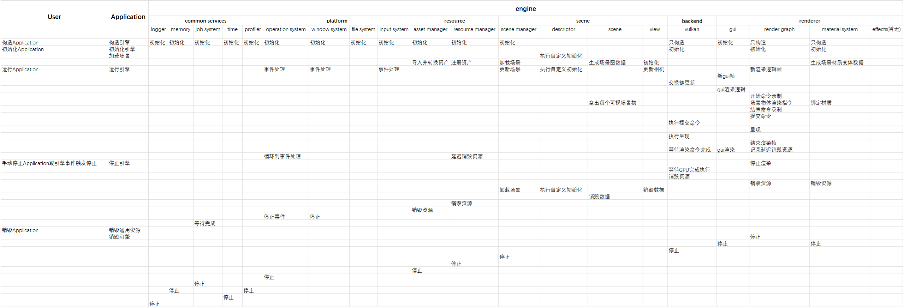

= 引擎架构

== 设计目标

一个高级版现代图形渲染引擎，本项目需要易于开发，维护，扩展，调试，测试，部署，理解，使用

== 关键指导思想

. KISS: 设计和实现简单，易于理解
. YAGNI: 不高估未来的需求，避免过度设计，过度工程化，过早优化
. SOLID: 高内聚、低耦合，多扩展少修改, 用抽象建立契约, 接口和实现分离，慎重引入依赖，依赖要倒置
. EA: 演进式架构，基于版本稳步演进

务实执行上述思想，不教条，使用工具和开发规约保障基本底线，平衡开发效率和质量

== 开发目标

. 功能实现符合预期，核心渲染循环具备可预测性
. 代码质量良好: 由工具和规约保障底线
. 代码易于测试: 为了平衡单人开发效率，有关键功能的简单测试，并保证通过
. 代码易于理解：由注释和文档保障，完成功能的同时，同时尽量减少代码量和高层次抽象，现阶段以体现设计思路，完成功能为主
. 代码易于调试: 主要由日志，调试工具，和可视化窗口保障

对于扩展性和健壮性，会在设计时基于具体场景进行权衡，一般来说会保留扩展空间，但不做过于超前的设计

目前整个引擎的设计为自主设计，代码和文档为手写，暂不引入AI

=== 运行时目标

. 引擎: 各个核心组件正常，生命周期可追踪、无内存泄漏，测试用例通过
. 线程功能: 保证线程安全, 执行正确，生命周期可追踪
. 渲染功能: 渲染Pass的执行顺序、资源屏障, 同步机制正确。无显存越界、无验证层报错、无画面闪烁等其他明显的显示问题
. 资源加载: 运行时无卡死报错

=== 部署时目标

. 解压即部署
. 暂只考虑windows平台部署，但预留跨平台构建和部署空间

=== 应该实现的关键功能点

包含的功能点包括：

. 引擎基础工具类: 包括自定义容器，内存管理，调试，性能追踪，剖析器，架构模式，设计模式基类，其他工具类
. 多线程: job system
. 资源管理: 离线与运行时资源处理分离，资源文件读写，解析，转换，加载，销毁等
. 平台层：预留跨平台接口，窗口系统，跨渲染底层扩展能力
. 场景管理: 数据驱动，属性中心架构，与资源系统，渲染系统解耦
. 测试用例: 核心功能提供测试用例
. 引擎使用示例: 会提供合适的使用示例，展示核心功能和使用方法
. vulkan底层封装: 自研图形底层封装，自研RHI，但是目前会以贴近vulkan实现为主
. 着色器功能: 支持slang运行时编译，热加载
. render graph: 支持自定义pass，支持forward, deferred等着色方式， 自动生命周期管理，自动屏障等
. 渲染技术: 支持PBR渲染

=== 暂不考虑的功能

. 完整的RHI: 但会预留RHI层抽象，具备可扩展性
. 完整的跨平台能力: 但会预留平台层抽象，并预留跨平台构建和配置的能力
. 完整的编辑器: 暂不完成，包括运行时反射功能
. AI辅助编程: 由于需要同时保证学习目的和技术真实水平，保持完整独立的原创性, 此阶段暂不引入
. 脚本系统: 暂不支持，但提供C++接口，和Application封装，可直接使用接口开发具体应用

== 架构及核心调用链

本引擎的架构是以工业级引擎的架构作为参考，并且结合实际情况做了精简和提炼。最终形成了本架构的设计

* 由于引擎是一项复杂工程，将采用逐步演进的方法实现目标
* 项目为自主设计和手动实现，虽有大量借鉴，但为完整自主设计和实现的作品，坚持不抄袭，独立设计和手写实现

=== 层级及模块划分介绍

* 引擎整体逻辑上为分层架构，每个层级内部有自己的子架构，每个层级拥有多个模块
* 模块间保持独立，基于未来扩展的考虑，只以文件夹区分模块，暂不拆分成独立库，模块在构建时静态连接作为一个整体引擎核心库
* 系统实际模块和对象基于此架构实现，但不一定与代码完全一致，以系统设计文档和实际代码为准
* 具体设计见系统设计文档和模块设计文档

. 平台层: 操作系统, 文件系统, 输入系统，窗口系统等
. 核心层: 工具类, 架构基类，全局配置类等，比如: 日志，数学库，profiler, 配置，反射，序列化, 内存管理, 线程池等
. 资源层: 分为离线资源和运行时资源，分别负责处理资产文件导入和运行时资源加载
. 渲染层(前端): 负责具体的渲染流程定义和具体的材质，特效定义，也包括gui, 比如: render graph, gui等
. 渲染层(后端): 负责使用RHI与底层GPU API调用和资源管理， 比如vulkan句柄封装，资源管理等
. 场景层: 负责管理场景相关数据，包括：场景描述，场景图，场景对象，相机，视图等
. 应用层: 通用资源和引擎常用功能封装，方便使用

=== 引擎架构及核心调用链

.阅读方式
. 类似泳道流程图，或时序图，从左往右，从上往下
. 若是相同模块的下一个步骤，放在同一列的下方
. 若是不同模块且在此模块右侧，则写到同一行对应模块的格子里
. 若是不同模块且在此模块左侧，写到下一行对应模块的格子里

.引擎核心模块及调用链(high-level)
[#img-high-level-architecture-layer, caption="图1:"]

=== 技术选型

所有库的依赖以满足需求的前提下，优先选轻薄，易用，成熟的库，目前阶段避免：大而全、不上不下、过时、或不够成熟的库

三方库调研和对比过程略

三方库中的类型必须封装成引擎内部类型，保证三方库的类型不强耦合在引擎中

==== 对"现代图形"需求的实现

. 采用C++23和Vulkan1.3作为主要技术
.. 20/23主要会使用的特性包括:
... concept: 用于约束模板类型
... designated init: 用于方便的在构造时确定参数
... expected: 代替错误码，异常，性能更好且易读
.. Vulkan支持dynamic rendering, bindless
.. shader语言为Slang
.. 三方库
... 数学库: 基于glm封装
... 标准库: 帧外部分允许使用{cpp} STL, 帧内部分使用自研容器或三方库容器，使用自定义分配器手动管理资源，详见系统设计
... 内存管理: 自研Arena内存分配器
... 窗口系统: 基于SDL3封装，并预留WSI接口方便扩展
... ECS: 基于EnTT封装，主要用于实现场景图
... job system: 基于EnkiTS开发，主要用于异步多线程场景数据处理
... gltf加载: 基于fastgltf封装,用于读取和解析gltf文件
... 纹理读取和转换: 基于stb和libktx封装
... 文件读写：基于stl filesystem封装并预留接口提供扩展性
... vulkan底层封装: 自研，采用vulkan-headers, vulkan-utility, vma, volk, spirv-reflect, slangc
... 测试/调试: Catch2, RenderDoc, Tracy，基于imgui提供性能剖析，调试可视化

==== 对"易于开发, 维护, 扩展, 部署"需求的实现

. 采用Git + CMake + vcpkg实现版本管理，模块化构建，三方库管理, 并提供跨平台部署和扩展的扩展性
. 采用clang-format + clang-tidy实现代码格式，代码质量的管理

==== 对"易于测试"需求的实现

. 采用Catch2实现测试功能，目前以保证核心功能点正常运行为主
. 以接口为契约，方便mock
. 提供基本功能的单元测试用例，和引擎整体使用样例

==== 对"易于调试"需求的实现

. 采用Vulkan验证层 + RenderDoc + Tracy，并在核心库配套debug, profiler, log工具，对引擎功能有监控测量的能力
. 集成日志，断言，和调试工具

==== 对"易于理解"需求的实现

. 采用doxygen+doxybook2+mkdocs工具链方案，且类/主要函数都有注释，并有丰富的文档，保证简明扼要，通俗易懂，尽量不堆砌高概念和专业辞藻
. 采用asciidoc整理整体文档(注：推荐使用vscode配合asciidoctor插件并打开kroki预览功能以获得最佳体验)
. 代码的追求是: 用最简洁的代码充分表达设计和思路，在满足目标的前提下，尽量避免过度工程化，过度设计
. 引擎会采用版本逐步迭代的方式推进，从最简实现逐步复杂化，会对每个大阶段以tag存档，方便回查

== 局限

. 由于人力有限，无法充分测试，后期考虑引入AI写测试用例，目前暂不考虑

=== 附录

==== 参考资料

. 架构设计相关
.. Game Engine Architecture
.. Clean Architecture
.. vulkan.org - building a Simple Engine
.. game programming patterns
.. Google - Filament
.. KDAP - KDGpu
.. NVIDIA - NvRHI

. 技术相关
.. {cpp} core guideline
.. modern CMake for {cpp}
.. real time rendering
.. vkguide.dev - vulkan guide
.. vulkan programming guide
.. vulkan cookbook
.. modern vulkan cookbook
.. mastering graphics programming with vulkan

还有许多参考资料，由于没有一一记录，此处略